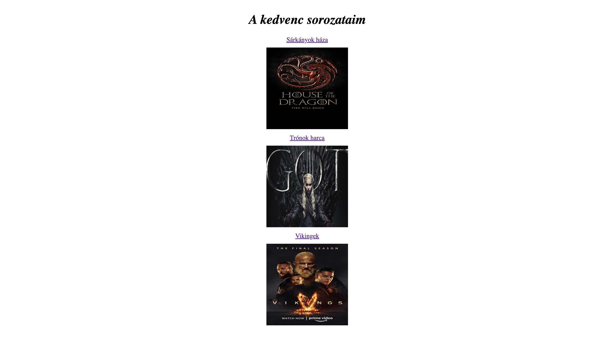

# Haladás

## Leírás

A következő feladatok által az elmúlt órai haladást ellenőrizzük.

1. Lépés készíts egy publikus repository-t github-on.
2. Clone-ozd le a számítógépedre. `git clone <link>`
3. Amint végeztél a feladatokkal pushold a munkád github-ra, hogy ellenőrízhessem.

```
git add .
git commit -m "a kommit leírása"
git push
```

## Programozás feladatok

0. Készíts egy `progress.js` file-t, ebben csináld a feladatokat.
1. Írd ki a console-ra: `Szeretnék megtanulni programozni.`.
2. Mentsd le változóba a kedvenc programozási nyelvedet stringként, írd ki a konzolra.
3. Ments le változóba két darab számot (pl: 10, 12). Írd ki konzolra a kettő szám szorzatát.
4. Ments le egy számot változóba (pl: 12). Ha a szám osztható 2-vel írd ki: `Páros vagyok`. Ha nem osztható: `Páratlan vagyok`. (If-el old meg, próbáld ki páros és páratlan számmal is)
5. Írd ki 10-szer: `Hazudni bűn.` ⚡ (While ciklussal)
5. Írd ki a páros számokat 10 és 500 között. (For ciklussal)
6. Egy függvény paraméterként vár egy string-et (a padtársad nevét). Returnölje a következőt: `Hello, <padtársad neve>`. Írd ki utána a konzolra.
7. Egy függvény paraméterként vár két darab számot, returnöld a kettő összegét. (Arrow function-el old meg.)

+ 1. Aki végzett: Írj egy függvényt ami eldönti egy szövegről hogy palindróm-e. Példa: `géza kék az ég`, `kész a szék`, `a cápa ette apáca`

## Webfejlesztés feladatok

Készíts egy "weboldalt" (html-t és css-t) az alábbi kép alapján.



- Legyen egy címsor. A cím stílusa legyen dőlt.
- Legyenek linkek amik mutatnak az adot sorozat IMDB oldalára.
- Legyenek alatta képek. (Mindegyik ugyanolyan méretben).
- Használj a sorok között eltartásokat. (margin/padding).
- Legyen minden középre rendezve.

Ha készen vagy kezdd el a programozás feladatokat - ha jársz programozás órára is és nem végeztél folytasd onnan, ahol legutóbb abbahagytad.
